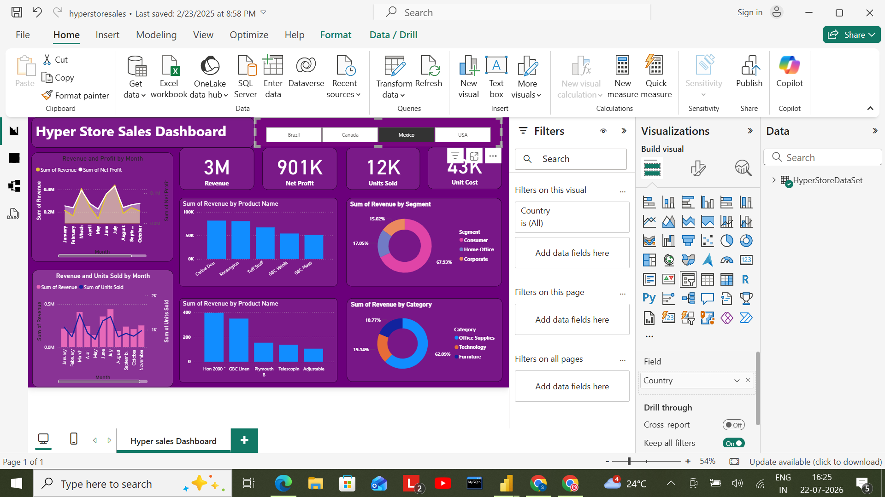
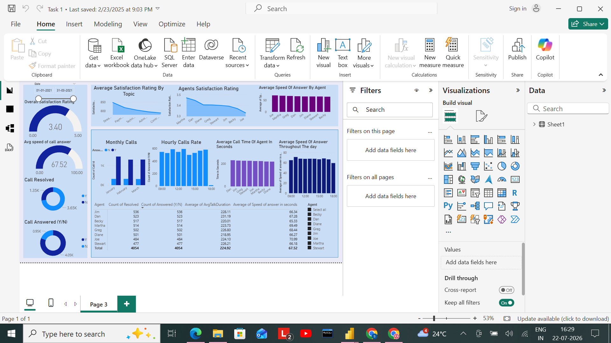

# CodTech IT Solutions — Data Analytics Internship

This repository contains the deliverables, Power BI interactive reports (`.pbix`), and documentation completed during my Data Analytics Virtual Internship at **CodTech IT Solutions**.

---

## 📑 Overview & Objectives

During this internship, I focused on transforming raw business datasets into interactive, visual data models to drive data-informed decision-making. 

### Key Highlights:
- Applied end-to-end data processing workflows using **Power Query** for cleaning and transformation.
- Constructed relational data models to link multiple business entities seamlessly.
- Authored custom **DAX measures** for key metrics, KPIs, and performance tracking.
- Designed structured dashboard layouts prioritizing user experience and clarity.

---

## 🖼️ Dashboard Visuals & Previews

| Hyperstore Sales Analysis | Report Preview |
| :---: | :---: |
|  |  |
| *Hyperstore Sales & Revenue Performance Dashboard* | *Key Performance Indicators & Category Breakdown* |

> 💡 **Note:** To interact with slicers, filters, and dynamic visuals, download the `.pbix` files from the [`reports/`](./reports) directory and open them in **Power BI Desktop**.

---

## 📂 Repository Structure

| Directory / File | Description |
| :--- | :--- |
| 📁 `reports/` | Power BI report files (`.pbix`) for assigned analytics tasks |
| 📁 `docs/` | Official task details and performance requirements |
| 📁 `assets/` | Internship completion certificate and dashboard screenshot previews |
| 📄 `README.md` | Project summary and navigation guide |

---

## 📊 Key Projects & Deliverables

### 1. Hyperstore Sales Analysis
- **Path:** `reports/Hyperstore_Sales_Analysis.pbix`
- **Focus:** Exploratory analysis of retail sales across product categories, geographic regions, and customer segments.
- **Key Insights:** Identified top revenue-generating product tiers and regional sales trends.

### 2. Performance Analytics Tasks
- **Paths:** `reports/Task_1_Sales_Dashboard.pbix`, `reports/Task_2_Analysis.pbix`
- **Focus:** Performance metrics tracking, breakdown analysis, and interactive filtering.

---

## 📜 Verification & Documentation

Official internship credentials and documentation are stored in this repository:
- 📄 [View Completion Certificate](assets/Codtech_Internship_completion_certificate.pdf)
- 📄 [View Task Requirements](docs/Power_BI_Task_Details.pdf)

---

## 🛠️ Tools & Technologies
* **Business Intelligence:** Microsoft Power BI Desktop
* **Data Transformation:** Power Query
* **Analytics Language:** DAX (Data Analysis Expressions)
* **Data Format:** Microsoft Excel / CSV
